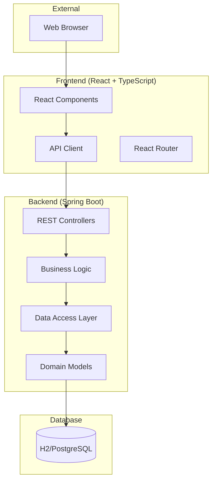
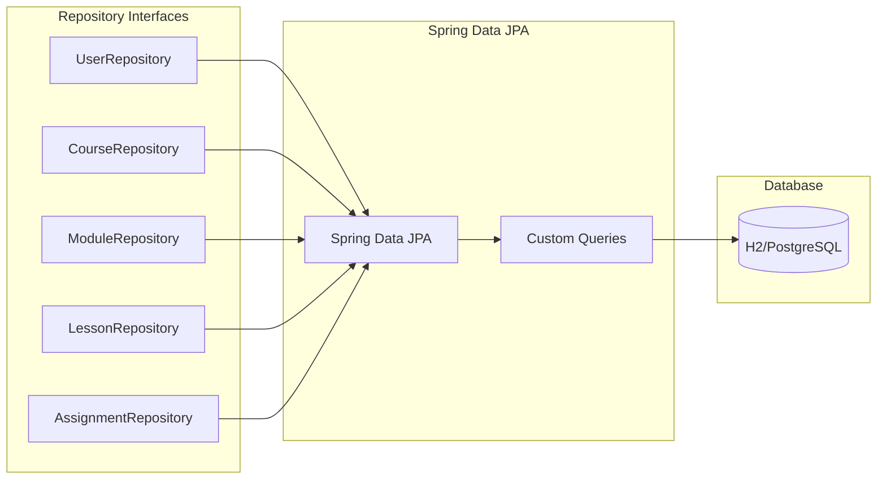
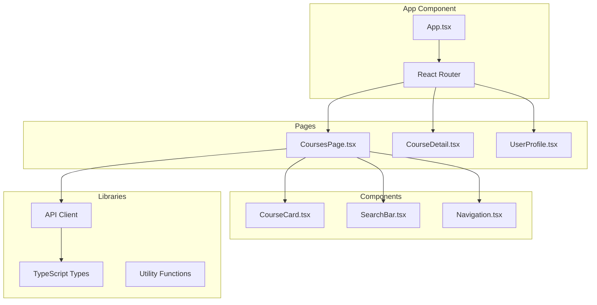
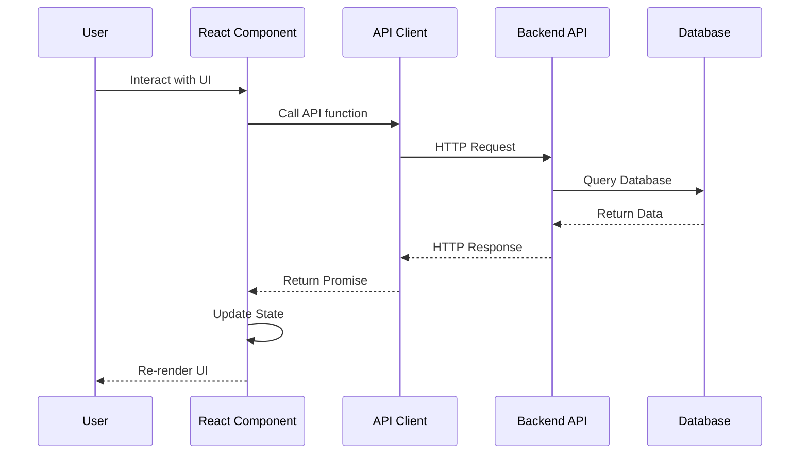
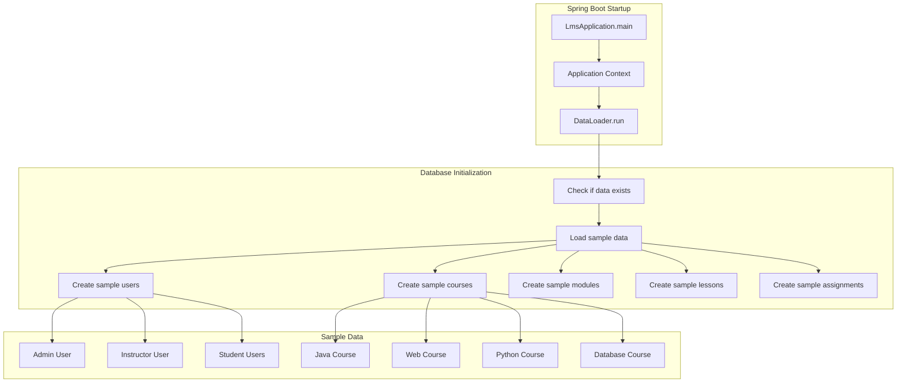
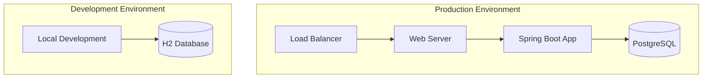

# Learning Management System - Architecture Diagram

## System Overview

This Learning Management System (LMS) is a full-stack application built with Spring Boot (Java) backend and React (TypeScript) frontend, designed to manage courses, modules, lessons, assignments, and user enrollments.

## High-Level Architecture



## Backend Architecture (Spring Boot)

### 1. Domain Layer (Entities)

```mermaid
classDiagram
    class User {
        +Long id
        +String username
        +String email
        +String password
        +String firstName
        +String lastName
        +UserRole role
        +Set~Enrollment~ enrollments
        +Set~Course~ instructorCourses
    }
    
    class Course {
        +Long id
        +String title
        +String description
        +String code
        +boolean isActive
        +boolean isPublished
        +Integer maxEnrollments
        +LocalDateTime startDate
        +LocalDateTime endDate
        +User instructor
        +Set~Module~ modules
        +Set~Assignment~ assignments
        +Set~Enrollment~ enrollments
    }
    
    class Module {
        +Long id
        +String title
        +String description
        +Integer orderIndex
        +boolean isPublished
        +Integer estimatedDurationMinutes
        +Course course
        +Set~Lesson~ lessons
    }
    
    class Lesson {
        +Long id
        +String title
        +String content
        +Integer orderIndex
        +boolean isPublished
        +Integer estimatedDurationMinutes
        +Module module
    }
    
    class Assignment {
        +Long id
        +String title
        +String description
        +LocalDateTime dueDate
        +Integer maxPoints
        +boolean isPublished
        +boolean allowLateSubmission
        +Course course
        +Set~AssignmentSubmission~ submissions
    }
    
    class Enrollment {
        +Long id
        +LocalDateTime enrolledAt
        +EnrollmentStatus status
        +User student
        +Course course
    }
    
    class AssignmentSubmission {
        +Long id
        +String content
        +LocalDateTime submittedAt
        +Integer score
        +SubmissionStatus status
        +User student
        +Assignment assignment
    }
    
    User ||--o{ Enrollment : has
    User ||--o{ Course : instructs
    Course ||--o{ Module : contains
    Course ||--o{ Assignment : has
    Course ||--o{ Enrollment : receives
    Module ||--o{ Lesson : contains
    Assignment ||--o{ AssignmentSubmission : receives
    User ||--o{ AssignmentSubmission : submits
```

### 2. Repository Layer



### 3. Controller Layer

```mermaid
graph TB
    subgraph "REST Controllers"
        CourseCtrl[CourseController]
        UserCtrl[UserController]
        ModuleCtrl[ModuleController]
        LessonCtrl[LessonController]
        AssignmentCtrl[AssignmentController]
    end
    
    subgraph "HTTP Endpoints"
        GET[GET /courses]
        POST[POST /courses]
        PUT[PUT /courses/{id}]
        DELETE[DELETE /courses/{id}]
        SEARCH[GET /courses/search]
        AVAILABLE[GET /courses/available]
    end
    
    subgraph "Cross-Origin"
        CORS[Cross-Origin Support]
    end
    
    CourseCtrl --> GET
    CourseCtrl --> POST
    CourseCtrl --> PUT
    CourseCtrl --> DELETE
    CourseCtrl --> SEARCH
    CourseCtrl --> AVAILABLE
    CourseCtrl --> CORS
```

## Frontend Architecture (React + TypeScript)

### 1. Component Structure



### 2. Data Flow



## Data Loading and Initialization

### 1. Application Startup Flow



## Technology Stack

### Backend
- **Framework**: Spring Boot 3.2.0
- **Language**: Java 17
- **Database**: H2 (development), PostgreSQL (production)
- **ORM**: Spring Data JPA with Hibernate
- **Build Tool**: Maven
- **Validation**: Bean Validation (Jakarta)

### Frontend
- **Framework**: React 18
- **Language**: TypeScript
- **Build Tool**: Vite
- **Routing**: React Router
- **Styling**: CSS Modules
- **HTTP Client**: Fetch API

### Development Tools
- **IDE Support**: ESLint configuration
- **Hot Reload**: Spring Boot DevTools + Vite HMR
- **Cross-Origin**: CORS enabled for development

## Key Features

1. **User Management**: Admin, Instructor, and Student roles
2. **Course Management**: Create, update, and manage courses
3. **Content Organization**: Hierarchical structure (Course → Module → Lesson)
4. **Assignment System**: Create and submit assignments
5. **Enrollment Management**: Student course enrollment tracking
6. **RESTful API**: Comprehensive backend API
7. **Modern Frontend**: Responsive React-based UI
8. **Data Persistence**: JPA-based data layer with multiple database support

## Security Considerations

- Input validation using Bean Validation
- CORS configuration for cross-origin requests
- Password handling (should be encrypted in production)
- Role-based access control structure

## Scalability Features

- Repository pattern for data access
- Service layer for business logic
- Entity relationships for efficient queries
- Modular component architecture
- Environment-based configuration

## Deployment Architecture



This architecture provides a solid foundation for a learning management system with clear separation of concerns, modern technology stack, and scalable design patterns.
